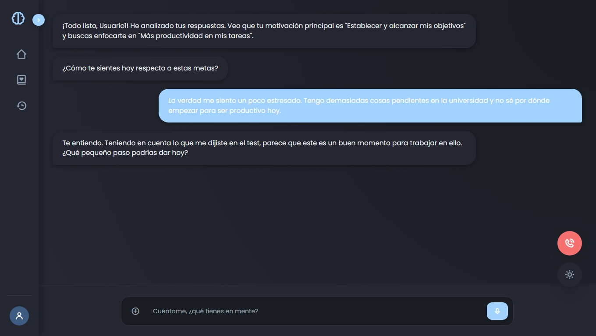

#  MenteSana - IA de Apoyo Emocional



MenteSana es una plataforma web interactiva diseñada para brindar apoyo emocional y herramientas de bienestar personal. A través de una interfaz moderna y un cuestionario de personalización, el sistema adapta su interacción para ofrecer respuestas más empáticas y enfocadas en los objetivos del usuario.

##  Características Principales

- **Onboarding Personalizado:** Sistema de registro inicial y test psicológico breve para perfilar las necesidades del usuario (motivación, productividad, bienestar).
- **Chatbot Interactivo:** Interfaz de chat fluida con respuestas simuladas basadas en el contexto del usuario.
- **Modo Oscuro/Claro:** Soporte nativo para temas visuales que mejoran la experiencia de usuario según su preferencia.
- **Diseño Adaptativo (Responsive):** Optimizado para dispositivos móviles y escritorio utilizando Tailwind CSS.
- **Arquitectura Limpia:** Separación de preocupaciones (HTML, CSS, JavaScript) para facilitar el mantenimiento y la escalabilidad.

##  Stack Tecnológico

- **Frontend:** HTML5, CSS3 (Custom Variables).
- **Framework de Estilos:** [Tailwind CSS](https://tailwindcss.com/) (CDN).
- **Iconografía:** [Boxicons](https://boxicons.com/).
- **Lógica de Programación:** JavaScript (ES6+).
- **Tipografía:** Poppins vía Google Fonts.

##  Estructura del Proyecto

```text
MenteSana/
├── index.html          # Estructura principal de la aplicación
├── style.css           # Estilos personalizados y variables de tema
├── js/
│   ├── quizData.js     # Datos y estructura de las preguntas del test
│   └── main.js         # Lógica de la interfaz, chat y control de estados
└── README.md           # Documentación del proyecto
```
## Instalación y Uso
Clona este repositorio:

```git clone [https://github.com/tu-usuario/mentesana.git](https://github.com/tu-usua```

Entra en la carpeta del proyecto:

```cd mentesana```

Abre el archivo ```index.html``` en tu navegador preferido.

📈 Próximas Mejoras (Roadmap)
[ ] Integración con la API de OpenAI (GPT-4) para respuestas reales.

[ ] Implementación de ```localStorage``` para persistir la sesión y el historial de chat.

[ ] Panel de estadísticas semanales sobre el estado de ánimo.

[ ] Notificaciones push para recordatorios de bienestar.
Proyecto desarrollado con fines académicos para la carrera de Ingeniería en Sistemas.